# Word Guesser

**"The difference between the almost right word and the right word is really a large matter.
It's the difference between the lightning bug and the lightning" (Mark Twain)**

## 1. Introduction

The word guesser is an online python-based terminal game developed as part of Code Institute third project requirement.

### 1.1 How To Play

The word guesser is a game revolves around figuring out the word the computer is picked.
The player is required to guess the selected word by the computer letter by letter.
The player wins if all the guessed letters are correct given a limited number of tries/chances.
The number of chances is defined as how many wrong letters are entered by the player before losing.
The player has three type of chances according to the difficulty choice. The difficulty choices are:

- Easy with three chances. There, the picked word is a three-letter word
- Intermediate with five chances. There, the picked word is a five-letter word
- Difficult with six chances. There, the picked word is a six-letter word

A link to the game is in [Word Guesser](https://words-guesser-62606aa4731f.herokuapp.com/) 


## 2. Development Process

The development process followed by the author consists of five phases, these are:

1. Research
2. Objective
3. Requirements Definition
4. Planning
5. Execution

These phases are presented below with a detailed account of each phase.

### 2.1. Research and Selection Criteria

The research phase commences with a survey on Portfolio Project 3 (PP3) works published by Code Institute (CI) students on the pear-review channel.
There is a wealth of information there where the author is able to extract and learn from. Additionally, the author conducted further research on YouTube and relevant websites. The search aims to identify a project idea that meets the selection criteria set by the author.

The selection criteria for selecting the project topic are:

1. Limited Scope
2. A range of python concepts can be implemented
3. Enough resources available in the literature about how to program the project in python

The research phase is concluded after settling on the Word Guesser game. The game offers many advantages. These advantages converge with the aforementioned selection criteria. The advantages are summarized in the following two points:

1. The literature offers a satisfactory resources about the game. This helps the author to collect the fundamental information needed to construct the game logic.
2. The game is limited in its scope.Its code, however, can cover multiple python concepts. Hence, Working on developing this game offers a low-risk sand-box to learn those concepts.

### 2.2. Project Objective

From the author perspective, the main objective of developing this game is to learn Python. In particular, the author's intention from the beginning is to implement the PP3 with Classes in mind as apposed to a function-based project. The use of classes is what distinguished an Object Oriented Programming (OOP) from other programming language that do not posses such capability. In PP2, the author exposed himself to the use of functions with JavaScript. Therefore, thinking in terms of functions is comprehended. For that reason, building python project with functions will not help the author much in his learning journey.Therefore, in addition to learning programming with Python, the secondary goal is to learn how to program with classes.

Although, the project is built with classes, the other OOP key concepts were not considered, such as:

- Full encapsulation.
- Inheritance
- Polymorphism
- Abstraction

Nevertheless, implementing the game with classes allowed the author to become familiar with these concepts. Additionally, by reviewing the finished code at the end of the development, the author is able to anticipate where such concepts can be invoked into the code for future improvement.

#### 2.2.1. Game Owner Objectives

The Game owner objectives are summarized in three main points, these are:

1. Easy to understand and simple to navigate
2. Engaging by having dynamic and colorful responses and presentation
3. Challenging through the introduction of multiple difficulty levels

#### 2.2.2. Game Visitor Objectives

The Game visitor objectives are summarized in two main points, these are:

1. Simple to understand and fun to play
2. Engaging and challenging

### 2.3. Game Requirements

Based on the main objectives presented in 2.2, 2.2.1 and 2.2.2, the following list of requirements is distilled:

1. The game should be build with python classes in mind
2. The game should start with welcoming statement
3. The game should display a simple, yet informative list of instructions to lead the player as how to play
4. The game should collect the player name
5. The game should have three difficulty levels, easy, intermediate and difficult
6. The game should allow the player to choose the difficulty level
7. A game should have a dashboard to display the game settings and status
8. The game should allow the player to restart or exit the game

### 2.4. Planning

In the following subsection the game logic developed during the planing phase is presented. 

#### 2.4.1. Game Logic

The major part of the planing is related to crafting an initial logic of the game.
One approach, of course, is to use a flow chart. The author, however, decides to develop a what might be considered to be a simplistic Pseudocode. The reason is that by writing such Pseudocode although not sophisticated by any standard, four paramount purposes can be served, these are:

1. Helping the author to comprehend the general logic of the game.
2. Helping the author to build a mental structure of the entire game. This aids the author to write the code with modularity in mind (let this modularity be functions or classes) with each module as simple as possible.
3. Helping the author to correct any misperception about how the author thinks the program would behave and how it would actually behave when the code runs.
4. Helping the author to practice the art of creating a standard Pseudocodes as early as possible in his learning journey.

This Pseudocode represents the core of the game logic only. The final code, and only if the time allows, may include additional modules, e.g. for game decorations etc. 
Any additional code will have been written in the final stages of the implementation shall not be included in this Pseudocode. Nevertheless, any change that has a direct impact on the core of the game logic is planned be updated here.

###### Word Guesser Pseudocode

```
words_storage:

    - create a words list
    - return word_storage

initiate_game:

    - display a welcome message
    - display the instructions
    - go to player

player:

    - input: Please input your first name:
        - if the input name is more than 10 or it is not part of the english alphabetic:
            - display: Please provide a valid name with less than 21 letters
        - else: 
            - display: Hello “Player’s first name”
            - go to difficulty_selection

difficulty_selection:

    - input: Please choose the difficulty level, enter 1,2 or 3:
        1.	easy  		
        2.	intermediate 	
        3.	difficult

    - if the input is not 1,2 or 3:
        display: Please choose 1,2, or 3

    - return difficulty_level

word_selector:

    - if difficulty_level is easy:
        - randomly choose word with 3-letter length from the words_storage
    - else if difficulty_level is intermediate: 
        - randomly choose a word with 5-letter length from the words_storage
    - else:
        - randomly choose a word with no less than 6-letter length from the words_storage
        - store the word in word_container
        - return word_container
    - num_of_chances = length of word_container
    got to player_guess

player_guess:

    - input: Please Enter a letter:
    - if the letter is not part of the English alphabetic:
        - display: Please enter a valid letter
        - return to Input
    - else:
        return the letter
    - go to evaluate_guessed_letters

evaluate_guessed_letters:

    - if the guessed_letter not in the word:
        go to letter_is_wrong
    - else:
        go to letter_is_correct

letter_is_wrong:
    if guessed_letter is in wrong_letter_container:
        display "You have already chosen this letter
    else:
        append the letter to the wrong_letter_container
    go to game_status

letter_is_correct:
    if guessed_letter is in correct_letter_container:
        print out "You have already chosen this letter
    else:
        append the letter to the correct_letter_container
    go to game_status

game_status

    - if the length of the wrong_letter_container is equal to word length:
	    - display: Bad luck, you lost this time
	    - go to restart_the_game	
    - if the length of the correct_letter_container is equal to word length:
	    - display: Congratulations, you won!
	    - go to restart_the_game

restart_game:

    - display: Do you want to restart the game? Yes/NO?
        - yes:
            - go to difficulty_selection
	    - no:
		    - exit the game

```
**Note: The Pseudocode code, if the author is allowed to call it Pseudocode, has significantly changed in evaluate_guessed_letters stage. Initially, the author wanted to remove the wrong guessed letter from the word_container. Where the word_container is a list containing all the letters of the selected word. if the word_container list becomes empty, the code signals that the game is over. This approach turned to be more complex than the described approach in the Pseudocode above.** 

In conclusion, a few small changes occur to the Pseudocode, e.g. changing method names etc... However, the change described in the note above represents the only major change to the Pseudocode.

### 2.5. Execution

The execution phase consists of six subsections. The first subsection lists the technologies used to develop the game. Features are presented in the second subsection. The data model is discussed in the third subsection. The fourth subsection is devoted for the test results. A full subsection is then devoted to discuss the bugs encountered during the development. This subsection also provides a detailed account of bugs that left without fixing. The final subsection is developed to describe the deployment procedures.

#### 2.5.1. Technologies Used

The following list of technologies are used to develop the game:

1. Python: Programming Language
2. GitHub: Development Platform
3. Gitpod: Cloud Development Environment
4. Heroku: Development Platform
5. CI Python Linter: Python code style convention checker

#### 2.5.2 Features

This section provides a detailed description of the main features of the game with screenshots.

- Welcome Screen

The Welcome Screen consists of a general welcome message. The player needs to press any key to proceed to the next screen. See the screenshot below:

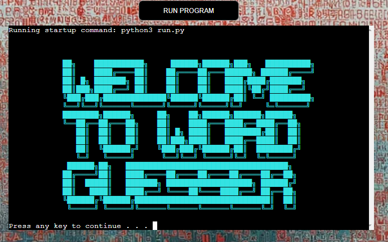

- Instructions Screen

Once the player presses any key, the instructions screen appears. The main purpose of this screen is to provide the rules and the instructions of the game. See the screenshot below:

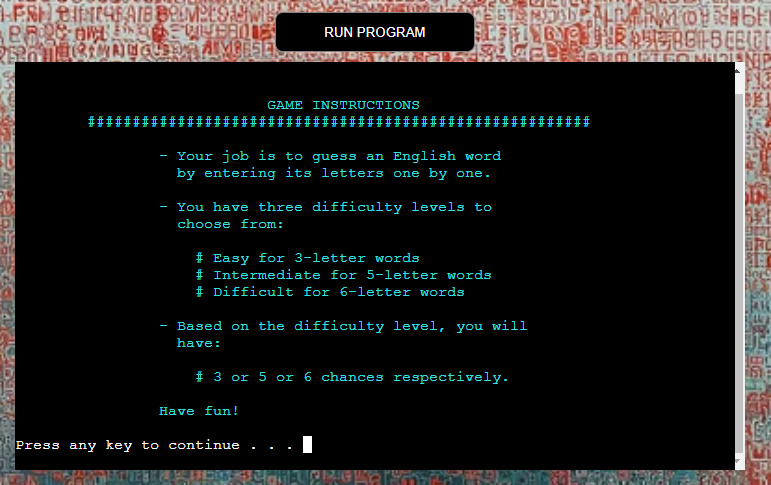

- Player Name

Once the player presses any key, the console asks the player to enter the player first name. The name is not valid if it contains non-alphabetic letters, spaces, empty or it consists of more than ten letters. See the screenshot below:

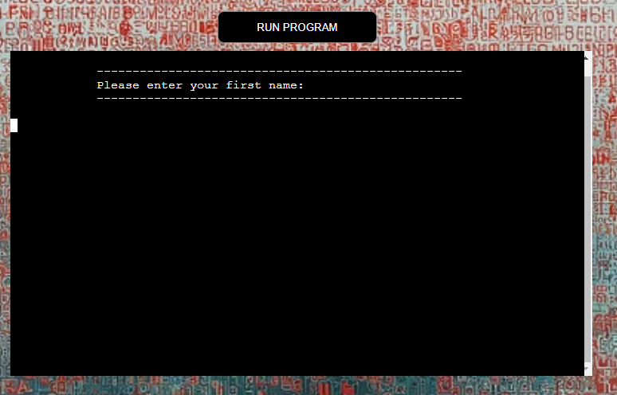

A selected error message, when entering invalid inputs for the first name, is provided. In the screenshot below, the player typed numbers as the first name.

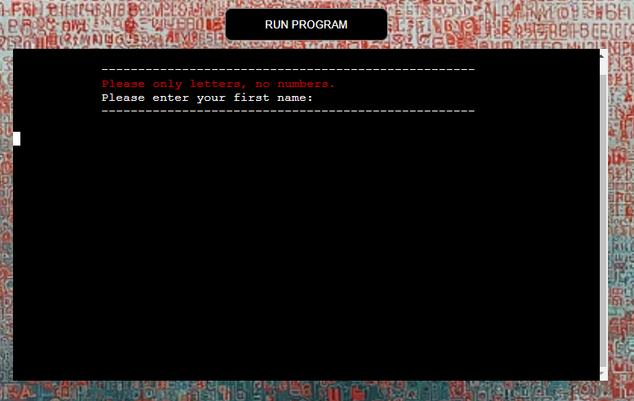

- Difficulty Selection

Once the player enters the first name correctly, the difficulty selection screen appears. It displays a list of difficulties the player can choose from. Please see the screenshot below:

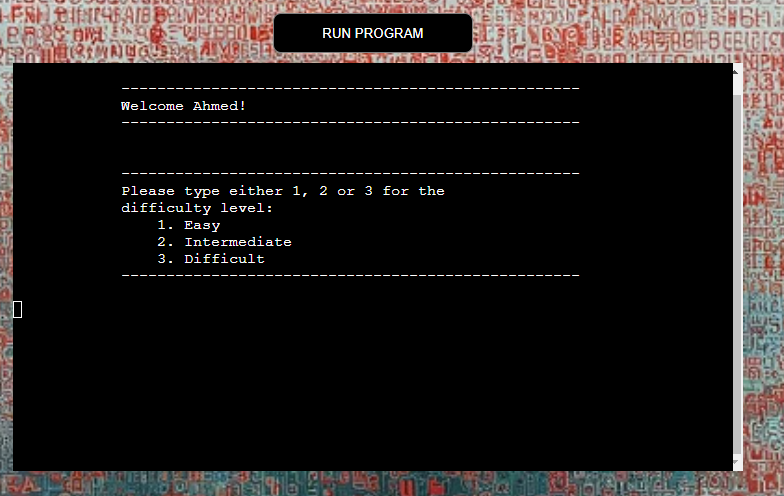

If the player enters a non valid input, an error message appears asking the player to enter either 1 or 2 or 3. See the screenshot below:

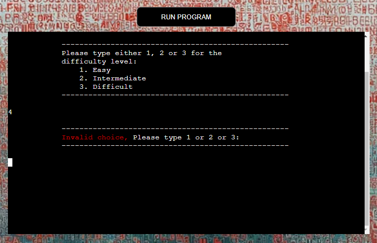

Once the player enters the correct difficulty choice, a message appears displaying the player's choice. In order to proceed, the player has to press any key. See the screenshot below:

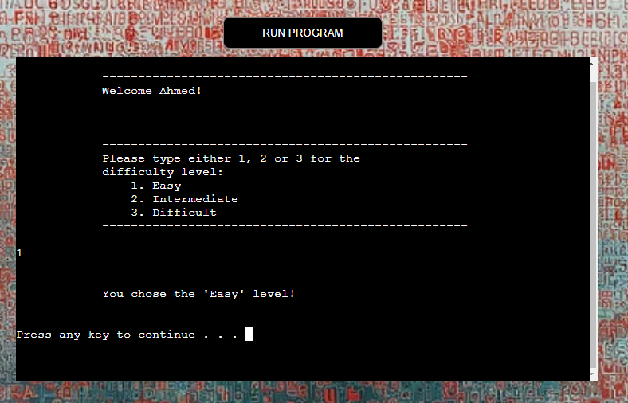

- Game Dashboard

Once the player proceeds, the game dashboard appears. The dashboard contains all the information the player needs in order to play the game. It is divided into three main section. 

A- Game Setting

This is a static section. It contains the player name, the difficulty level and the number of chances based on the chosen difficulty level.
    
B- Game Status:

This section is dynamic. It changes according to the player choices. It contains a container showing the correct letters are adding if they player is guessing the correct letter. It contains another container for the wrong letters. Finally, it posses a counter that count the number of chances left for the player after every choice.

C- Game Message:

This section is concerned with the provisioning of game feedback. It helps the player to know if the guessed letter is wrong or correct, if the letter is guessed already or the entered character is not valid. It also informs the player if the game status is won or lost. See the screenshot for multiple scenarios.

The game here is in easy level. The player has 3 chances to guess a three-letter word.

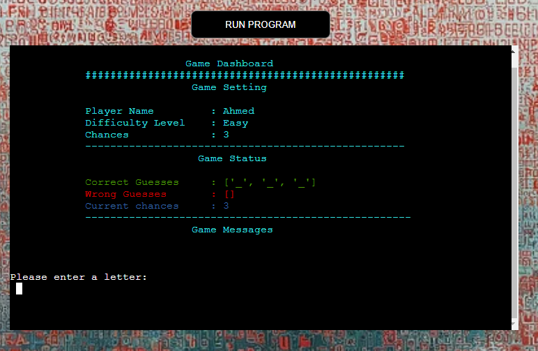

In the screenshot below, it seems that the player got the letter right.

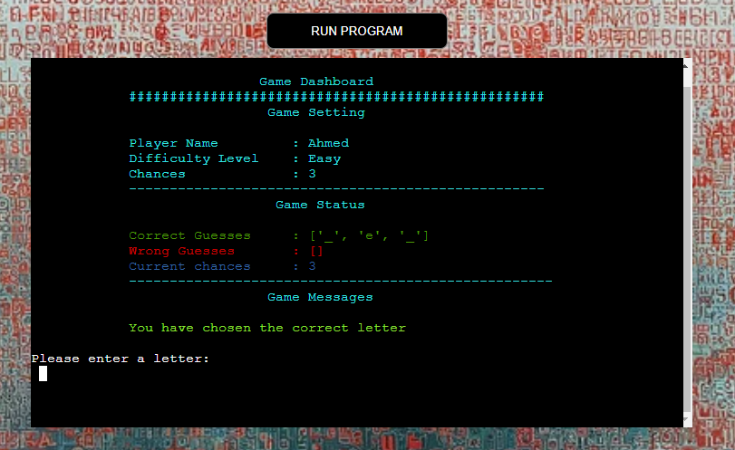

Here is a warning message. It informs the player that the letter, which is just typed in, is already guessed.


The luck does not stay long with our friend, the player got the letter wrong in the screenshot below.

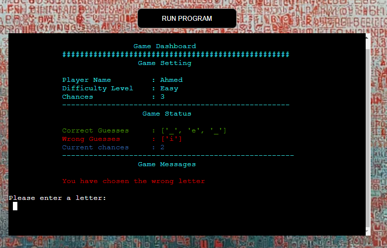

There is a list of error messages that can also appear if the player enters invalid inputs, such like: non-alphabetic characters or pressing Ctrl C and Ctrl D. A Selected example is presented in the following screenshots.

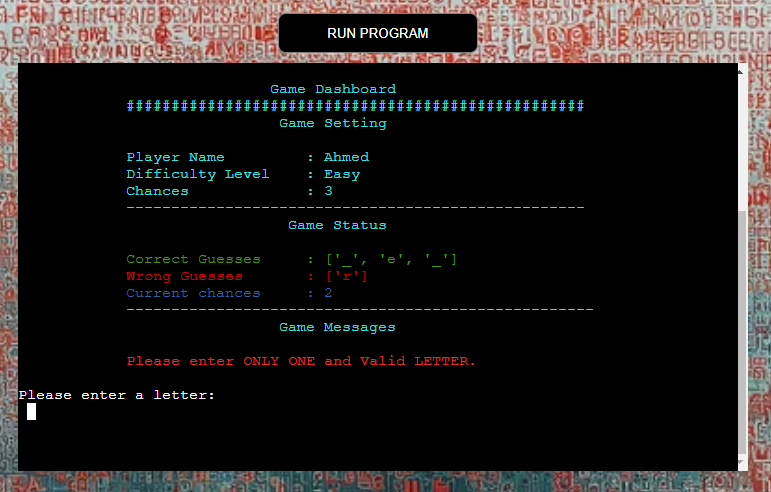

A Won message appears when the player guesses all the letter correctly without exhausting the available chances. See the screen below:

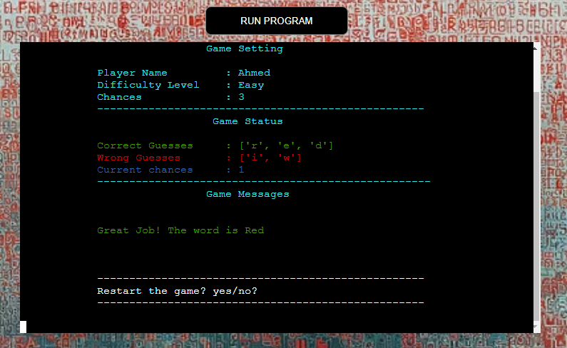

If the player exhausted all the chances the loss message appears, as shown below:

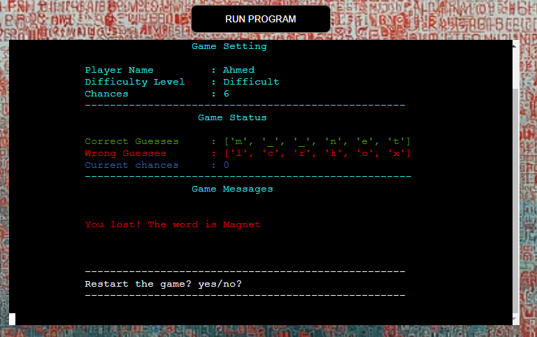

As it can be seen from the two screenshots above, once the game is concluded a messages appears asking the player if a game reset is needed.

In case the player entered invalid input for the reset message, an error message appears. Such scenario happens when the player neither enter "yes"/"y" for reset nor "no"/"n" for exit.
The error message also considers the situation where the player pressed Ctrl C or Ctrl D. A selected example is shown below:


If the player decides to reset the game by entering "yes" or "y"
the game will take the player back to the difficulty selection. If the player, however, decides to leave the game, then a GoodBy message appears as shown below:

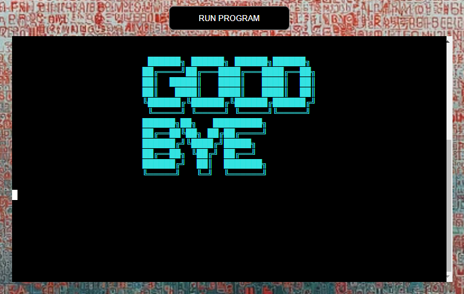

- Favicon

The last feature is the Favicon for the website. The Favicon consists of two letters A and Z with a background color of light cyan. The image is created by [ChatGPT](https://openai.com/).


#### 2.5.3 Conceptual Data Model

In this section, the conceptual data model of the game is presented. This conceptual data model is built after the development is complete. It can be read in conjunction with reading of the game logic in the planing section for further clarity.

The game consists of five classes and one mixin class. The mixin class contains methods that can be used by any of the other classes.
As it is shown in the figure below, all the relationships are one to one relationship with an initiate rule.


#### 2.5.4 Test Results

The test results of CI Python Linter are summarized in the table below. The test comes out clear from any errors or warnings. The test captures can be found in 
[Test file](test.md).

| Test ID No. | Test Name | Test Result | Test Comment|
| ----------- |---------- |------------ |------------ |
| 1 | CI Python Linter| pass |The test is conducted for each class |
| 2 | Manual Test of every conceivable player input and game scenario |Pass | |
| 3 | Lighthouse Test| pass | |
| 4 | W3C Markup Validation Service| pass ||
| 5 | W3C CSS Validation Service| pass with two warnings. The warnings are: -ms-user-select is a vendor extension and -webkit-user-select is a vendor extension |Please refer to unfixed bugs|

#### 2.5.5. Bugs

This subsection is devoted to summarize the bugs encountered by the author during the development. The subsection is divided into two subsections. The first is devoted for the fixed bugs. While the second is devoted to describe the unfixed bugs.

##### 2.5.5.1. Fixed Bugs

In this subsection, a list of fixed bugs is recounted with a description of how they are fixed.

| Bug ID No. | Bug Position | Bug Description | Bug Solution | Comment|
| -----------| ----------- |---------- |------------ |------------ |
|1| Class DifficultySelection in line 38|f-string is used without variable | The f-string is removed| |
|2| Class WordSelector|In case of short list of words in word_bank, the search does not fully cover all the words in the list | Introducing a counter that has a length equals to the length of the word_bank. This ensures the complete word search in the word_bank| |
|3| Classes: Player, DifficultySelection, PlayerGuess and GameMixins|When using a For loop for dictionary with items() method, an alert is observed. The alert complains that either the key or the value of the dictionary is not used | Use either values() or keys() methods instead of the items() method. Then remove the unused item, i.e. either the key or the value from the For loop| |

##### 2.5.5.2 Unfixed Bugs

In this subsection a list of unfixed bugs with description is provided. The list contains three bugs, all of them are not the result of the author under performing (Big Claim!). The three bugs, to the best of the author knowledge, come with the original Python console.

| Bug ID No. | Bug Position | Bug Description | Bug Solution | Comment|
| -----------| ----------- |---------- |------------ |------------ |
|1| HTML file| Alert of a missing heading structure | Add H1 element with content| The author decides to leave it the way it is since the alert comes with original Python console. Please refer to [Test file](test.md) to see the screenshot|
|2| HTML file|Within the Chrome DevTools: a form field element should have an id or name attribute. A form field element has neither an id nor a name attribute. This might prevent the browser from correctly auto filling the form | Chrome DevTools suggestion is to add a unique id or name attribute to a form field. This is not strictly needed, but still recommended even if you have an autocomplete attribute on the same element| The author decides to leave it the way it is since the issue comes with original Python console. Please refer to [Test file](test.md) to see the screenshot|
|3| Game URL| appeared on W3C CSS Validation Service (-ms-user-select is a vendor extension and -webkit-user-select is a vendor extension)|NA| The author decides to leave the warnings the way they are since the they come with original Python console. Please refer to [Test file](test.md) to see the screenshot|
|4| CI Python Console|When the game is reset multiple times the console does not effectively clear the screen completely, resulting in accumulating snaps of screen views from earlier rounds| NA| The author decides to leave it the way it is since the alert comes with original Python console. Please refer to [Test file](test.md) to see the screenshot|

#### 2.5.6 Deployment, Clone and Fork Procedures

This section is devoted to explain procedures conducted by the author to deploy and clone the game code. Additionally, for those who are interested to create fork from the main branch, a dedicated procedure is also provided.

- Heroku

The following procedure is implemented to deploy the game on Heroku platform:

1. Create a list of requirements/dependencies for the game. In order to that, the following steps is to be executed:
    - Go to the command line terminal of development environment (Gitpod)
    - Type "pip3 freeze > requirements.txt" (requirements.txt is the file where the list of requirements is stored)
    - Add this change and commit it
    - Push the change to the GitHub repository
2. Sign in to Heroku account 
3. On Heroku dashboard, click on "Create a new app" button
4. Within the "Create New App" window, go to the "App name" input field and type in an App name
5. Within the same window, choose your region from the "Choose region" dropdown menu
6. Click on "Create app" button
7. New window opens for the App that is just created
8. Within this window, from the 7 taps available, select "Settings"
9. Within the setting tap window, go to "Confg Vars"
10. Click on "Create Confg Vars"
11. Two input fields appear, one for key and one for value
    - Within the "key" input field type: PORT
    - Within the "value" field type: 8000
    - Click on "Add"
12. Scroll down to "Buildpacks", within the Buildpacks, follow the listed sub-steps below:
    - Click on "Add buildpacks"
    - A "Add buildpack" window opens
    - From the list, choose "Python" first
    - Click on "Save changes" button
    - From the same list, choose "nodejs" second
    - Click on "Save changes" button
    - Ensure Keeping the order packs as described in last 4 sub-steps
13. Now go to the "Deploy" tap right at the top of the window
14. Within the "Deployment method" row, click on "GitHub" button
15. Within the "Connect to GitHub" (One row down the Deployment method) click on "Connect to GitHub"
16. Wait a bit for loading
17. Now on the same row and within the search field, type the name of the project repository and click on "Search" button
18. Now click connect
19. Once it is connected to the project repository, scroll down to "Manual Deploy"
20. Within this row, click on "Deploy Branch"
21. Once the deploy log is finished, a message appears and hopefully says: "You app was successfully deployed"
22. Below it a "View" button appears as well
22. Click on the "View" to open the deployed project on a new browser tap 

**Note: Throughout the development, the author chooses only the manual deployment.**

- GitHub

The following procedure is followed to create the game repository

1. Go to your repositories 
2. Open CI P3-template
3. On the top right, click on "Use this template"
4. Click on "Create a new repository"
5. New window opens
6. In the field of "Repository name" type the project name
7. Choose public
8. Then click on "Create repository"

- Clone into Gitpod

The following procedure is implemented to clone from the GiTHub repo into Gitpod:

1. Go to the "code" in the upper right corner
2. Select "local" 
3. Select "Clone/HTTPs"
4. Copy the url provided
5. Open new browser tap
6. Open your Gitpod Workspace
7. Click on "Create new workspace"
8. Click on "select new Repository"
9. Paste the url in input window
10. Click continue

- Fork

For any person interested to work on the source code of this project, here is the procedure that needs to be followed to make a fork.

1. Go to ahmedcodein repositories
2. Click on "word_guesser" repo
3. In the upper right corner, click of "fork" drop down menu
4. Click on "create new fork"
5. Create new fork window opens
6. Select the "owner" of the repo
7. Add a name to "Repository name"
8. Add a description to the "Description" field if needed
9. Click on "Create fork "

## 3 Future Work

The game has the potential to extend its capabilities to include additional options and features, for instance:

1. Instead of exiting the game completely, the game can go back to the general welcome screen with two options displayed on that screen. The first 
is to display the instructions once again and the second option is to jump directly into the difficulty selection
2. Extending the difficulty levels to cover words with 4, 7 letters
2. More languages can be included to reach larger base of players who are interested to play the game in other languages
3. A score to count the number of guessed words with each round

## 4 Credits

### 4.1 References

- CI Study Materials, [Code Institute](https://codeinstitute.net/de/bildungsgutschein/?utm_term=code%20institute&utm_campaign=CI%2B-%2BUK%2B-%2BSearch%2B-%2BBrand&utm_source=adwords&utm_medium=ppc&hsa_acc=8983321581&hsa_cam=16493764737&hsa_grp=132915436966&hsa_ad=635790877675&hsa_src=g&hsa_tgt=kwd-319867646331&hsa_kw=code%20institute&hsa_mt=e&hsa_net=adwords&hsa_ver=3&gad_source=1&gclid=Cj0KCQjw3tCyBhDBARIsAEY0XNlk5PQerlGAVupYRw0WPKtdiPb9QBFPzUv-YEGIv5cb6FJe1G24uVwaAoZKEALw_wcB)
- CI PP3 Student Project, [Battleships](https://github.com/dnlbowers/battleships)
- CI PP3 Student Project, [Hangman](https://github.com/ilyasolgun11/hangman)
- CI PP3 Student Project, [Life in Number](https://github.com/queenisabaer/life-in-numbers)
- CI PP3 Student Project, [Memory Game](https://github.com/CsClown/MemoryGame)
- Python OOP Tutorials, [Working with Classes](https://www.youtube.com/playlist?list=PL-osiE80TeTsqhIuOqKhwlXsIBIdSeYtc)
- FreeCodeCamp.org, [12 Beginner Python Projects - Coding Course](https://www.youtube.com/playlist?list=PL-osiE80TeTsqhIuOqKhwlXsIBIdSeYtc)
- Delft Stack, [How to Clear Console in Python](https://www.delftstack.com/howto/python/python-clear-console/)
- Markdown Cheat Sheet, [Markdown Guide](https://www.markdownguide.org/cheat-sheet/).
- Conventional Commits, [A specification for adding human and machine readable meaning to commit messages](https://www.conventionalcommits.org/en/v1.0.0/)

### 4.2. Content and Tools

- [ChatGPT](https://chat.openai.com/auth/login?sso) is used to generate the Background and the Favicon images. It is also used to generate the list of words required for this game. Additionally, it is used to understand various programming concepts.
- [Word counter](https://wordcounter.net/character-count) is used to track the number of characters of each git commit.
- [Favicon Generator](https://www.favicon.cc/?) is used to generate the Favicon file.
- [Image Resizer](https://redketchup.io/image-resizer) is used to convert the favicon row image from Web Picture (Webp) into Portable Network Graphics (PNG) extension.
- [Lucid](https://lucid.app/documents#/documents?folder_id=home) is used to create the Conceptual Data Model

### 4.3. Acknowledgement

I would like to express my sincere gratitude to Mr. David Bowers for his outstanding mentorship. With every project, he proves 
again and again his dedication and integrity to provide all what a student might need to success. Moreover, his advice and encouragement to use classes for 
this project is particularly appreciated. Additionally, his provision of further resources on the topic has helped me immensely in this project.
I would also like to thank my family for playing the game and providing their feedback on its look and interface.