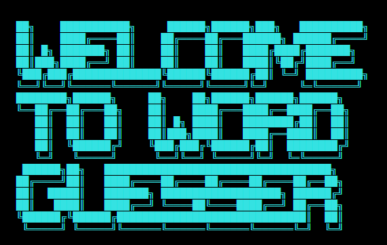
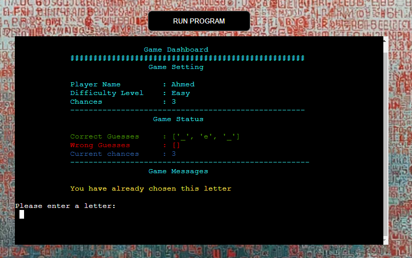
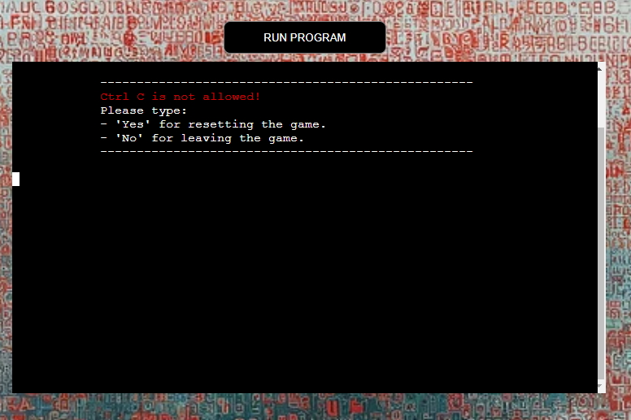

# Word Guesser

**"The difference between the almost right word and the right word is really a large matter.
It's the difference between the lightning bug and the lightning", - Mark Twain**

## 1. Introduction

The word guesser game is a game revolves around figuring out what word the computer is picked.
The player then try to guess the word letter by letter. The player wins if all the guessed letters
are correct given a limited number of tries/chances.
The number of chances is defined as how many wrong letters are entered by the player.
The player has three type of chances based on the difficulty choice. The difficulty choices are:

- Easy with three chances. There the picked word is a three-letter word
- Intermediate with five chances. There, the picked word is a five-letter word
- Difficult with six chances. There, the picked word is a six-letter word

A life link to the game is in [Word Guesser](https://words-guesser-62606aa4731f.herokuapp.com/) 



## 2. Development Process

The process followed by the author consists of five phases, these are:

1. Research
2. Objective
3. Requirements Definition
4. Planning
5. Execution

These phases are presented below with a detailed account of each phase is presented in the subsequent sections.

### 2.1. Research and Selection Criteria

The research phase commences with a survey on Portfolio Project 3 (PP3) works published by Code Institute(CI) students on the pear-review channel.
There is a wealth of information there where the author is able to extract and learn from. Additionally, other searches are also
conducted on YouTube and relevant websites.
A summary of the reasons of choosing this game is:

1. Satisfactory amount of resources is available to extract information about the game. Whether under the word guesser name, or Hangman etc..., the game seems to be very popular among python developers. This makes it a good candidate since it is relatively easy to find information about how to approach the development. 
2. Although, it is limited in its scope, its code can cover multiple python concepts. Hence, it represents a low-risk sand-box to learn those concepts considering the available time for PP3.

### 2.2. Project Objective

From the author perspective, the main objective of developing this game is to learn Python. In particular, the author's intention from the beginning of the research phase is to implement the PP3 with Classes in mind as apposed to a function-based project. The main reason for that is that the use of classes is what distinguished an Object Oriented Programming (OOP) from other programming language that do not posses such capability. In PP2, the author exposed himself to the use of functions with JavaScript. Therefore, thinking in terms of functions is successfully comprehended. For that reason, building python project with functions will not help the author much in his learning endeavour in this training program. Therefore, in addition to learn programming with Python, the secondary goal is to learn how to program with classes.

#### 2.2.1. Game Owner Objectives

1. Easy to understand and simple to navigate
2. Engaging by having dynamic and colorful responses and presentation
3. Challenging through the introduction of multiple difficulty levels

#### 2.2.2. Game Visitor Objectives

1. Simple to understand and fun to play
2. Engaging and challenging

### 2.3. Game Requirements

Based on the main objectives presented in 2.2, 2.2.1 and 2.2.2, the following list of requirements is distilled:

1. The game is python classes-based code
2. A landing window welcoming the player
3. A simple, yet informative list of instructions to lead the player as how to play
4. A way to collect the player name
5. The game has three difficulty levels, easy, intermediate and difficult
6. A possibility to allow the player to choose the difficulty level
7. A game Dashboard displaying the game settings and status
8. A way to allow the player to restart or exit the game

### 2.4. Planning

The major part of the planing is related to crafting an initial logic of the game.
One approach of course is to use a flow chart. The author, however, decides to develop a what might be considered to be a simplistic Pseudocode. The reasons for that is explained in the following subsection.

#### 2.4.1. Game Logic

During the planning phase, the author chooses to write a simple Pseudocode for the project. The reason is that by writing such Pseudocode although not sophisticated by any standard, four paramount purposes are served, these are:

1. Helping the author to comprehend the general logic of the game.
2. Helping the author to build a mental structure of the entire game. This aids the author to write the code with modularity in mind (let this modularity be functions or classes) with each module as simple as possible.
3. Helping the author to correct any misperception about how the author thinks the program would behave and how it would actually behave when the code runs.
4. Helping the author to practice the art of creating a standard Pseudocodes as early as possible in his software development journey.

This Pseudocode, however, represents the core of the game logic only. The final code, and only if the time allows, may include additional modules, e.g. for game decorations etc. 
Any additional code will have been written in the final stages of the implementation shall not be included in this Pseudocode. Nevertheless, any change that has a direct impact on the core of the game logic is planned be updated here.

###### Word Guesser Pseudocode

```
words_storage:

    - create a words list
    - return word_storage

initiate_game:

    - display a welcome message
    - display the instructions
    - go to player

player:

    - input: Please input your first name:
        - if the input name is more than 10 or it is not part of the english alphabetic:
            - display: Please provide a valid name with less than 21 letters
        - else: 
            - display: Hello “Player’s first name”
            - go to difficulty_selection

difficulty_selection:

    - input: Please choose the difficulty level, enter 1,2 or 3:
        1.	easy  		
        2.	intermediate 	
        3.	difficult

    - if the input is not 1,2 or 3:
        display: Please choose 1,2, or 3

    - return difficulty_level

word_selector:

    - if difficulty_level is easy:
        - randomly choose word with 3-letter length from the words_storage
    - else if difficulty_level is intermediate: 
        - randomly choose a word with 4-letter length from the words_storage
    - else:
        - randomly choose a word with no less than five-letter length from the words_storage
        - store the word in word_container
        - return word_container
    - num_of_chances = length of word_container
    got to player_guess

player_guess:

    - input: Please Enter a letter:
    - if the letter is not part of the English alphabetic:
        - display: Please enter a valid letter
        - return to Input
    - else:
        return the letter
    - go to evaluate_guessed_letters

evaluate_guessed_letters:

    - if the guessed_letter not in the word:
        go to letter_is_wrong
    - else:
        go to letter_is_correct

letter_is_wrong:
    if guessed_letter is in wrong_letter_container:
        display "You have already chosen this letter
    else:
        append the letter to the wrong_letter_container
    go to game_status

letter_is_correct:
    if guessed_letter is in wrong_letter_container:
        print out "You have already chosen this letter
    else:
        append the letter to the wrong_letter_container
    go to game_status

game_status

    - if the length of the correct_letter_container is equal to word length:
	    - display: Bad luck, you lost this time
	    - go to restart_the_game	
    - if the length of the correct_letter_container is equal to word length:
	    - display: Congratulations, you won!
	    - go to restart_the_game

restart_game:

    - display: Do you want to restart the game?Yes/NO?
        - yes:
            - go to difficulty_selection
	    - no:
		    - exit the game

```
**Note: The Pseudocode logic, if the author is allowed to call it Pseudocode, has significantly changed in evaluate_guessed_letters stage. Initially, the author wanted to remove the guessed letter each time wrong guess occurs from the word_container. Where,word_container is a list contains all the chosen word letters. Then use the empty list, after all the chances exhausted as a signal of game over with player lose event. This is turned to be more complex than the proposed approach present in the new version of the Pseudocode.** 

Few small changes occur to the Pseudocode, e.g. changing method names etc... However, The change described in the note above represents the only major change to the Pseudocode.

#### 2.4.2 The Conceptual Data Model

In this section, the conceptual data model of game is presented. This conceptual data model is built after the development is complete. It is therefore might not be fully suited to be part of the planing phases, the author decides to included in here since it aids the game logic understanding.


### 2.5. Execution

#### 2.5.1. Technologies Used

The following list of technologies are used to develop the game:

1. Python: Programming Language
2. GitHub: Development Platform
3. Gitpod: Cloud Development Environment
4. Heroku: Development Platform
5. CI Python Linter: Python code style convention checker 

#### 2.5.2 Test Results

The test results of CI Python Linter are summarized in the table below. The test is pass, no errors or warnings are observed. The test captures can be found on 
[Test file](test.md) file.

| Test ID No. | Test Name | Test Result | Test Comment|
| ----------- |---------- |------------ |------------ |
| 1 | CI Python Linter| pass |The test is conducted for each class |

#### 2.5.3. Bugs

This subsection is devoted to a list of bugs encounter the author during the development.
All the bugs are fixed.

##### 2.5.3.1. Fixed Bugs

| Bug ID No. | Bug Position | Bug Description | Bug Solution | Comment|
| -----------| ----------- |---------- |------------ |------------ |
|1| Class DifficultySelection in line 38|f-string is used without variable | The f-string is removed| |
|2| Class WordSelector|for short list of words in word_bank, the search does not fully span all the word in the list | introducing a counter that has word_bank length to ensure the complete search for the word in the word_bank| |
|3| Classes: Player, DifficultySelection, PlayerGuess and GameMixins|Using for loop for dictionary and items method, alert is observed when either the key or the value of the dictionary is not used | Use either values or keys method, and remove the unused in the key-value pair| |

##### 2.5.3.2 Unfixed Bugs

In this subsection a list of unfixed bugs with description is provided. The list contains three bugs, all of them are not the result of the author under performance. The three bugs, to the best of the author knowledge, come with the original Python console.

| Bug ID No. | Bug Position | Bug Description | Bug Solution | Comment|
| -----------| ----------- |---------- |------------ |------------ |
|1| HTML file| Alert of a missing heading structure | Add H1 element with content| The author decides to leave it the way it is since the alert comes with default design of CI console. Please refer to [test.md](test.md) to see the screenshot|
|2| HTML file|A form field element should have an id or name attribute. A form field element has neither an id nor a name attribute. This might prevent the browser from correctly auto filling the form. | Chrome DevTools suggestion: To fix this issue, add a unique id or name attribute to a form field. This is not strictly needed, but still recommended even if you have an autocomplete attribute on the same element| The author does not consider finding a resolution to this issue since it comes as a default issue with CI console design, Please refer to [test.md](test.md) to see the screenshot|
|3| CI Python Console|There is an issue with the console occurs when the game is reset multiple time. It seems that console does not effectively clear the screen completely after each game reset, resulting in accumulating some previous screen views from earlier rounds| NA| The author assumes this as a default flaw in Python Console. Please refer to [test.md](test.md) to see the screenshot|

## 2.5.4. Deployment, Clone and Fork Procedures

The following procedure is implemented to deploy the game on Heroku platform:

1. Create a list of requirements/dependencies for the game. In order to that, the following steps is to be executed:
    - Go to the command line terminal of development environment (Gitpod)
    - Type "pip3 freeze > requirements.txt" (requirements.txt is the file where the list of requirements is stored)
    - Add this change and commit it
    - Push the change to the GitHub repository
2. Sign in to Heroku account 
3. On Heroku dashboard, click on "Create a new app" button
4. Within the "Create New App" window, go to the "App name" input field and type in an App name
5. Within the same window, choose your region from the "Choose region" dropdown menu
6. Click on "Create app" button
7. New window opens for the App that is just created
8. Within this window, from the 7 taps available, select "Settings"
9. Within the setting tap window, go to "Confg Vars"
10. Click on "Create Confg Vars"
11. Two input fields appear, one for key and one for value
    - Within the "key" input field type: PORT
    - Within the "value" field type: 8000
    - Click on "Add"
12. Scroll down to "Buildpacks", within the Buildpacks, follow the listed sub-steps below:
    - Click on "Add buildpacks"
    - A "Add buildpack" window opens
    - From the list, choose "Python" first
    - Click on "Save changes" button
    - From the same list, choose "nodejs" second
    - Click on "Save changes" button
    - Ensure Keeping the order packs as described in last 4 sub-steps
13. Now go to the "Deploy" tap right at the top of the window
14. Within the "Deployment method" row, click on "GitHub" button
15. Within the "Connect to GitHub" (One row down the Deployment method) click on "Connect to GitHub"
16. Wait a bit for loading
17. Now on the same row and within the search field, type the name of the project repository and click on "Search" button
18. Now click connect
19. Once it is connected to the project repository, scroll down to "Manual Deploy"
20. Within this row, click on "Deploy Branch"
21. Once the deploy log is finished, a message appears and hopefully says: "You app was successfully deployed"
22. Below it a "View" button appears as well
22. Click on the "View" to open the deployed project on a new browser tap 

Note: Throughout the development, the author chooses only the manual deployment.


The following procedure is implemented to clone from the GiTHub repo into Gitpod:

1. Go to your repositories 
2. Click on the new created project repository
3. Go to the code in the upper right corner
4. Click on the Code dropdown menu
5. Select local 
6. Select Clone/HTTPs
7. Copy the url provided
8. Open new browser tap
9. Open your Gitpod Workspace
10. Create new workspace
11. Click on select new Repository
12. Paste the url in input window
13. Click continue

For any person interested to work on the source code of this project, here is the procedure that needs to be followed to make a fork.

1. Go to ahmedcodein repositories
2. Click on word_guesser repo
3. In the upper right corner, click of fork drop down menu
4. Click on create new fork
5. Create new fork window opens
6. Select the owner of the repo
7. Add a repo name
8. Add a description if needed
9. Click create fork 


## 3. Features

This section provides a detailed description of the main features in the game with screenshots.

- Landing page
The landing page consists of a general welcoming message to the game. The player needs to press any key to proceed to the next page which is the instruction page. See the screenshot below:


- Instructions page

Once the player press any key, the instructions page appears. The main purpose of this page is to provide the rules and instructions of the game. See the screenshot below:


- Player Name

Once the player presses any key, the console asks the player to enter the player first name. The name is not valid if it contains non-alphabetic letters, spaces, empty or it consists of more than ten letters. See the screenshot below:


A selected error message, when entering invalid inputs for the first name, is provided in the screenshot below where the player typed numbers as the first name.


- Difficulty Selection

Once the player enters the first name correctly, the difficulty selection window appears, with a list of difficulties the player can choose from. Please see the screenshot below:


If the player enters a non valid input, an error message appears asking the player to enter either 1 or 2 or 3. See the screenshot below:


Once the player enters the correct difficulty choice, a message appears displaying the choice. In order to proceed, the player has to press any key. See the screenshot below:


Game Dashboard

Once the player proceeds, the game dashboard appears. The dashboard contains all the information the player needs in order to play the game. It is divided into three main section. 

    A. Game Setting:

    It contains the player name, the difficulty level and the number of chances based on the chosen difficulty level.
    
    B. Game Status:
    
    This section is dynamic, it changes according to the player choices. It contains a container showing the correct letters adding if they player is guessing the correct letter. It contain another container for the wrong letters. Finally, it contains a counter that count the number of chances left for the player after every choice.

    C. Game Message:
    
    This section is concerned with the provision of user feedback. It helps the player to know if the guessed letter is wrong or correct, if the letter is guessed already or simple the entered character is not valid. It also tells the user if the player won or lost. See the screen shoot from multiple scenarios.

The game here is in easy level. The player has 3 chances to guess a three-letter word


In the screenshot below, it seems that the player got the letter write.


Here is an waring message, that the player has already entered the letter.



The luck does not stayed long with our friend, the player got it wrong here.


There are a list error messages can also appear if the player enters invalid inputs, non-alphabetic characters, including pressing Ctrl C and Ctrl D. A Selected example is presented in the following screenshots.


A Won message appears when the player guesses all the letter correctly without exhausting the available chances. See the screen below:


if the player exhausted all the chances the loss message appears, as shown below:


As it can be seen from the two screenshots above, once the game is concluded a messages appears asking the player if game reset is needed.

In case the player entered invalid input for the reset message, an error message appears. Such scenario happens when the player does not enter "yes" or "y" for reset nor "no" or "n" for exit.
The error message also considers if the player pressed Ctrl C or Ctrl D. A selected example is shown below:



If the player decides to reset the game by entering "yes" or "y"
the game will take the player back to the difficulty selection. If the player, however, decides to leave the game, than you message appear as shown below:


- Favicon

The last feature is the Favicon for the website, the Favicon consists of two letters A and Z with a background color of light cyan. The image is created by [ChatGPT](https://openai.com/).


## 4 Future Work

The game has the potential to extend its capabilities to include additional options and features, for instance:

1. Extending the difficulty levels to cover words with 4, 7 letters or more
2. More languages can be included to reach larger base of players who are interested to play the game in other languages
3. A score to account for the number of words are guessed with each game round

## 5 Credits

### 5.1 References

- CI Study Materials, [Code Institute](https://codeinstitute.net/de/bildungsgutschein/?utm_term=code%20institute&utm_campaign=CI%2B-%2BUK%2B-%2BSearch%2B-%2BBrand&utm_source=adwords&utm_medium=ppc&hsa_acc=8983321581&hsa_cam=16493764737&hsa_grp=132915436966&hsa_ad=635790877675&hsa_src=g&hsa_tgt=kwd-319867646331&hsa_kw=code%20institute&hsa_mt=e&hsa_net=adwords&hsa_ver=3&gad_source=1&gclid=Cj0KCQjw3tCyBhDBARIsAEY0XNlk5PQerlGAVupYRw0WPKtdiPb9QBFPzUv-YEGIv5cb6FJe1G24uVwaAoZKEALw_wcB)
- CI PP3 Student Project, [Battleships](https://github.com/dnlbowers/battleships)
- CI PP3 Student Project, [Hangman](https://github.com/ilyasolgun11/hangman)
- CI PP3 Student Project, [Life in Number](https://github.com/queenisabaer/life-in-numbers)
- CI PP3 Student Project, [Memory Game](https://github.com/CsClown/MemoryGame)
- Python OOP Tutorials, [Working with Classes](https://www.youtube.com/playlist?list=PL-osiE80TeTsqhIuOqKhwlXsIBIdSeYtc)
- FreeCodeCamp.org, [12 Beginner Python Projects - Coding Course](https://www.youtube.com/playlist?list=PL-osiE80TeTsqhIuOqKhwlXsIBIdSeYtc)
- Delft Stack, [How to Clear Console in Python](https://www.delftstack.com/howto/python/python-clear-console/)
- Markdown Cheat Sheet, [Markdown Guide](https://www.markdownguide.org/cheat-sheet/).
- Conventional Commits, [A specification for adding human and machine readable meaning to commit messages](https://www.conventionalcommits.org/en/v1.0.0/)

### 5.2. Content and Tools

- [ChatGPT](https://chat.openai.com/auth/login?sso) is used to generate the Background and the Favicon images.
- [ChatGPT](https://chat.openai.com/auth/login?sso) is used to generate the list of words required for this game.
- [ChatGPT](https://chat.openai.com/auth/login?sso) is used to to understand various programming concepts.
- [Word counter](https://wordcounter.net/character-count) is used to track the number of characters of each git commit.
- [Favicon Generator](https://www.favicon.cc/?) is used to generate the Favicon file.
- [Image Resizer](https://redketchup.io/image-resizer) is used to convert the favicon row image from Web Picture (webp) into Portable Network Graphics (PNG) extension.
- [Lucid](https://lucid.app/documents#/documents?folder_id=home) is used to create the Conceptual Data Model

### 5.3. Acknowledgement

I would like to express my sincere gratitude to Mr. David Bowers for his outstanding mentorship. With every project, he proved 
again and again his dedication and integrity to provide all what a student needs to success. His encouragement to use classes for 
this project and the provision of further resources on the topic have helped me immensely in this project.
I would also like to thank my family for playing the game and providing their feedback on its outlook and interface.