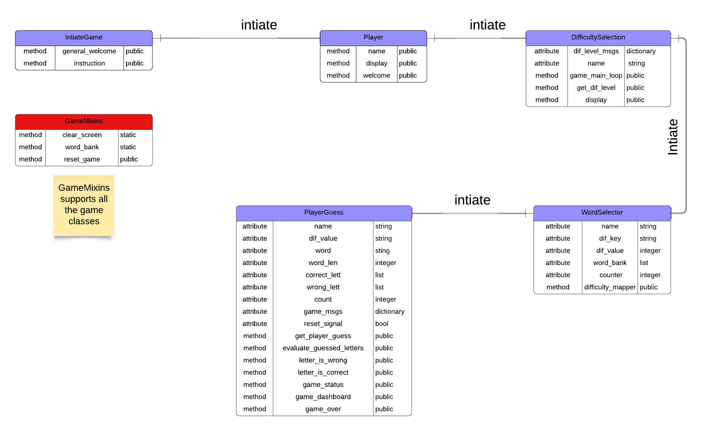

# Word Guesser

## 1. Introduction
The word guesser game is a game revolves around figuring out what word the computer is picked.
The player then try to guess the word letter by letter. The player wins if all the guessed letters
are correct given a limited number of tries/chances.
The number of chances is defined as how many wrong letters are entered by the player.
The player has three type of chances based on the difficulty choice. The difficulty choices are:

- Easy with three chances. There the picked word is a three-letter word
- Intermediate with five chances. There, the picked word is a five-letter word
- Difficult with six chances. There, the picked word is a six-letter word

## 2. Development Process

The process followed by the author consists of five phases, these are:

1. Research
2. Objective
3. Requirements Definition
4. Planning
5. Execution

These phases are presented below with a detailed account of each phase is presented in the subsequent sections.

### 2.1. Research and Selection Criteria

The research phase commences with a survey on Portfolio Project 3 (PP3) works published by Code Institute(CI) students on the pear-review channel.
There is a wealth of information there where the author is able to extract and learn from. Additionally, other searches are also
conducted on YouTube and relevant websites.
A summary of the reasons of choosing this game is:

1. Satisfactory amount of resources is available to extract information about the game. Whether under the word guesser name, or Hangman etc..., the game seems to be very popular among python developers. This makes it a good candidate since it is relatively easy to find information about how to approach the development. 
2. Although, it is limited in its scope, its code can cover multiple python concepts. Hence, it represents a low-risk sand-box to learn those concepts in considering the available time for PP3.


### 2.2. Project Objective

From the author perspective, the main objective of developing this game is to learn Python. In particular, the author's intention from the beginning of the research phase is to implement the PP3 with Classes in mind as apposed to a function-based project. The main reason for that is the use of classes is what distinguished an Object Oriented Programming (OOP) from other programming language that do not posses such capability like JavaScript. Where in PP2, the author exposed himself to the use of functions with JavaScript. Therefore, thinking in terms of functions is successfully comprehended. For that reason, building python project with functions will not help the author much in his learning endeavour in this training program. Therefore, in addition to learn programming with Python, the secondary goal is to learn how to program with classes.

#### 2.2.1. Website Owner Objectives

#### 2.2.2. Website Visitor Objectives

### 2.3. Website Requirements

### 2.4. Planning

#### 2.4.1. Game Logic

During the planning phase, the author chooses to write a pseudocode for this project. Although, this is not part of the assessment requirements of this project and it is a time consuming, the author takes the risk of writting it. The reason is that by writting the pseudocode, four paramount purposes are served, these are:

1. Helping the author to comprehend the general logic of the game.
2. Helping the author to build a mental structure of the entire game. This aids the author to write the code with modularity in mind (let this modularity be functions or classes) with each module as simple as possible.
3. Helping the author to correct any misperception about how the author thinks the program would behave and how it actually behaves when the code runs.
4. Helping the author to practice the art of creating pseudocodes as early as possible in his software development journey.

The following pseudocode represents the core of the game logic only. Form the author perspective, the core of the game logic is what matters for this project. Therefore, the final code, and only if the time allows, may include additional modules, e.g. for game decorations etc. 
Any additional code will have been written in the final stages of the implementation shall not be included in this pseudocode. Nevertheless, any change that has a direct impact on the core of the game logic is planned be updated here.

###### Word Guesser Pseudocode

```
words_storage:

    - create a words list
    - return word_storage

initiate_game:

    - display a welcome message
    - display the instructions
    - go to player_name

player_name:

    - input: Please input your first name:
        - if the input name is more than 20 or it is not part of the english alphabit:
            - display: Please provide a valid name with less than 21 letters
        - else: 
            - display: Hello “Player’s first name”
            - go to difficulty_selection

difficulty_selection:

    - input: Please choose the difficulty level, enter 1,2 or 3:
        1.	easy  		
        2.	intermediate 	
        3.	difficult

    - if the input is not 1,2 or 3:
        display: Please choose 1,2, or 3

    - return difficulty_level

word_selector:

    - if difficulty_level is easy:
        - randomly choose word with 3-letter length from the words_storage
    - else if difficulty_level is intermediate: 
        - randomly choose a word with 4-letter length from the words_storage
    - else:
        - randomly choose a word with no less than five-letter length from the words_storage
        - store the word in word_container
        - return word_container

num_of_chances_calculator:

    - num_of_chances = length of word_container
    - display num_of_chances: “You have got ‘num_of_chances ‘ chances”
    - return num_of_chances

player_guess:

    - input: Please Enter a letter:
    - if the letter is not part of the english alphabit:
        - display: Please enter a valid letter
        - return to Input
    - return the letter
    - go to letters_container

letters_container:

    - set count as the number of times this function is called
    - set guessed_letter_container to empty
    - if the count is not 0:
	    - if the letter in the letter_container
		    - display: “You chose this letter already, please select another one”
		    - Go to player_guess
	- else if:
        - add the guessed letter into the guessed_letter_container on the right index
        - display guessed_letter_container
        - return the letter
        - go to guess_evaluator

guess_evaluator:

    - if the letter in the word_container:
        - remove the letter from the word_container
        - display “letters_container, Great Job, you guessed the right letter!”
        - if word_container length is 0:
            - go to game_status
        - else:
            - go to player_guess
        - return word_container
    - else:
        - display: “Bad luck, you guessed the wrong letter”
        - decrease num_of_chances by 1
        - if num_of_chances is 0:
	        - go to game_status
        - else: 
            - go back to player_guess
            - return num_of_chances

game_status

    - if num_of_chances == 0:
	    - display: Bad luck, you lost this time
	    - go to restart_the_game	
    - if the length of the word_container == 0:
	    - display: Congratulations, you won!
	    - go to restart_the_game

Restart_game:

    - display: Do you want to restart the game?Yes/NO?
        - yes:
            - go to difficulty_selection
	    - no:
		    - exit the game

```

#### 2.4.2 The Conceptual Data Model

In this section, the conceptual data model of game is presented. Up until this point, only the initial parts of the game is considered when developing the data model.


### 2.5. Execution

#### 2.5.1. Technologies Used

#### 2.5.2 Test Results

The test results are summarized in the table below.

| Test ID No. | Test Name | Test Result | Test Comment|
| ----------- |---------- |------------ |------------ |
| 1 | | | |

#### 2.5.3. Bugs

##### 2.5.3.1. Fixed Bugs

| Bug ID No. | Bug Position | Bug Description | Bug Solution | Comment|
| -----------| ----------- |---------- |------------ |------------ |
|1| | | | |

##### 2.5.3.2. Unfixed Bugs

## 2.5.4. Deployment, Clone and Fork Procedures

## 3. Features

## 4 Future Work

## 5 Credits

### 5.1 References

### 5.2. Content and Tools

### 5.3. Acknowledgement
