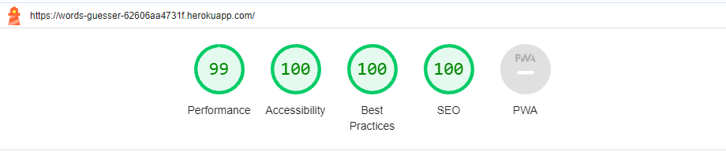
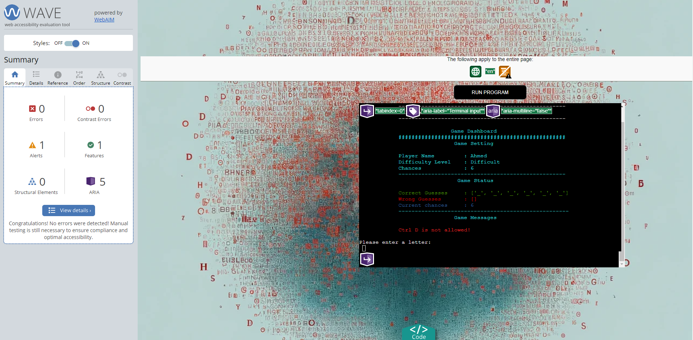
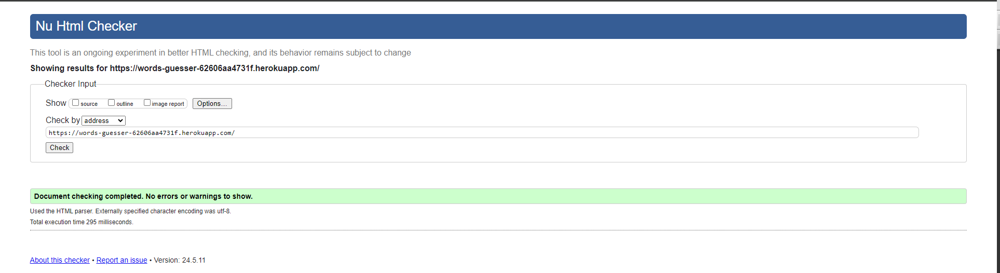
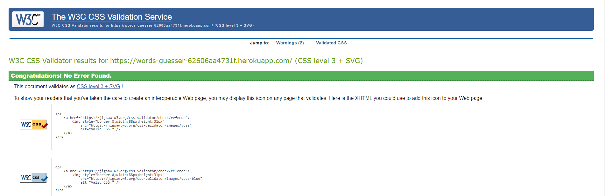
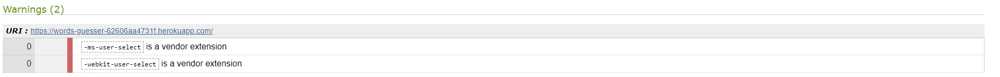
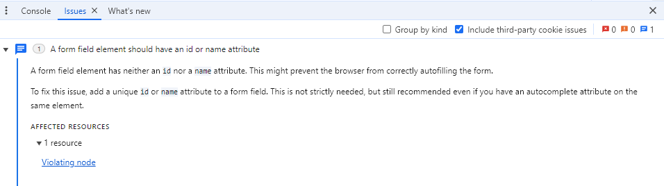
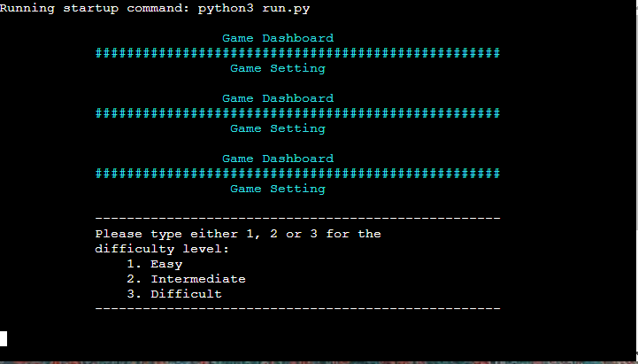

# Test Appendix

This Appendix contains the screenshots of all the tests conducted.

## CI Python Linter

This file contains the captures of the test results of CI Python Linter for each class code.

1. Class InitiateGame

2. Class Player

3. Class DifficultySelection

4. Class WordSelector

5. Class PlayerGuess

6. Class GameMixins

## Lighthouse Test

The following screenshot shows the test result of Lighthouse tool.

**The initial test shows an issue of missing meta tags for the search engin. The issue is resolved by adding the relevant tags.**

## Web Accessibility Evaluation Tools (WAVE)

The following screenshot shows the test result of Wave. It is worth mentioning here that test shows an alert of missing a heading structure. The solution is to add an H1 heading element. The author did not resolve the issue because the alert comes with original python console.

## W3C Markup Validation Service

The following screenshot shows the test result of W3C Markup Validation Service. The result does not show any errors.

## W3C CSS Validation Service

The following screenshot shows the test result of W3C CSS Validation Service. The result does not show any errors. However, there are two warnings appear in the test. These are:

- -ms-user-select is a vendor extension
- -webkit-user-select is a vendor extension

The author did not try resolve these warnings since they come with the original Python console. 

## Chrome DevTools

In Chrome DevTools, the author observes the following issue: 

**A form field element should have an id or name attribute
A form field element has neither an id nor a name attribute. This might prevent the browser from correctly auto filling the form.
To fix this issue, add a unique id or name attribute to a form field. This is not strictly needed, but still recommended even if you have an autocomplete attribute on the same element.**

The author did not resolve the issue because the alert comes with original python console.

A screenshot of the issue is provided below:

## Console Flaw

There is an issue with the console occurs when the game is reset multiple times. It seems that console does not effectively clear the screen resulting in accumulating snaps of previous screen views from earlier rounds. See the screenshot below.

Return to [Readme file](README.md)

