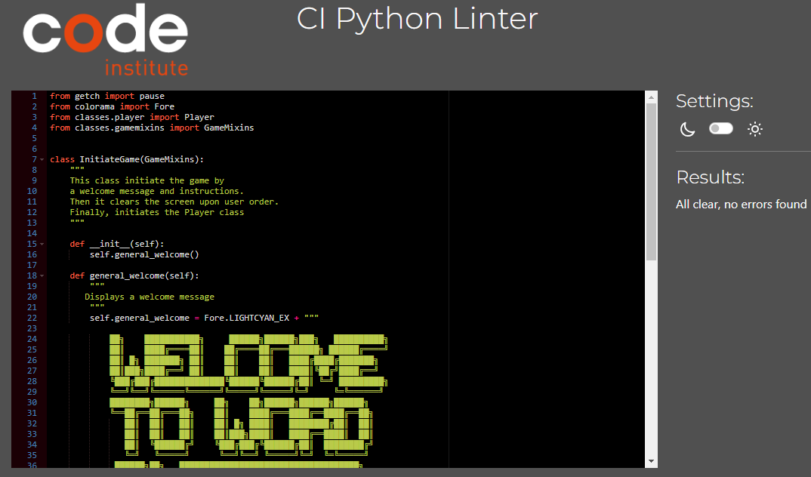
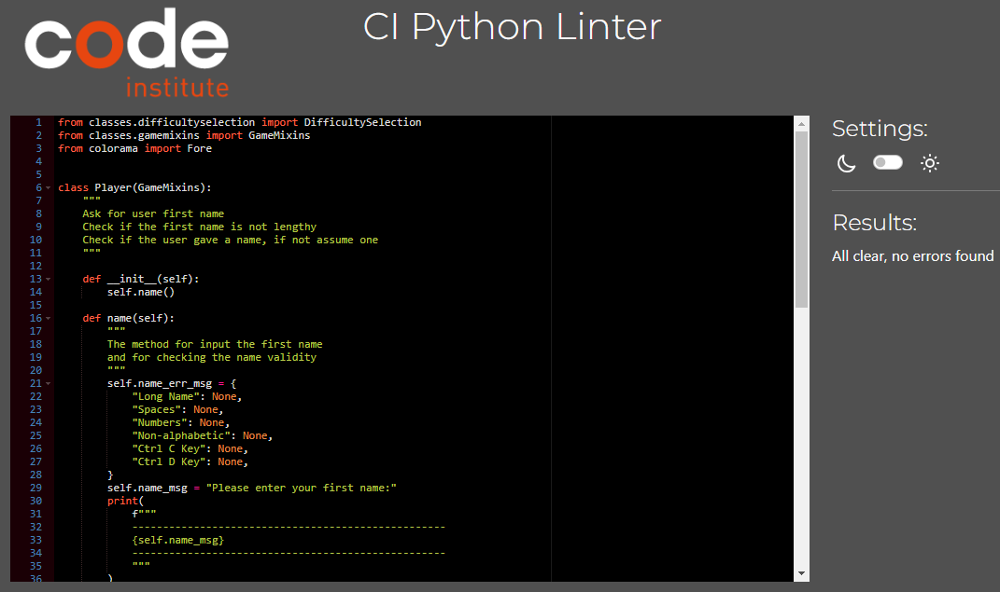
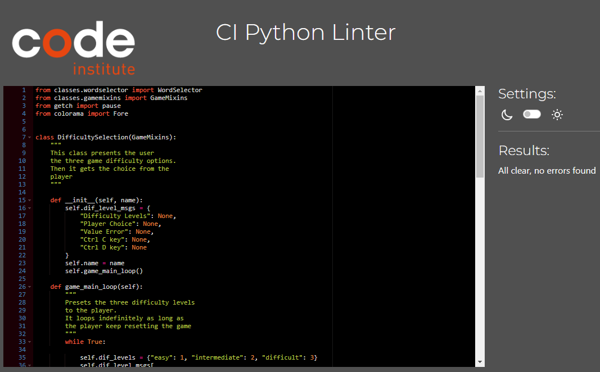
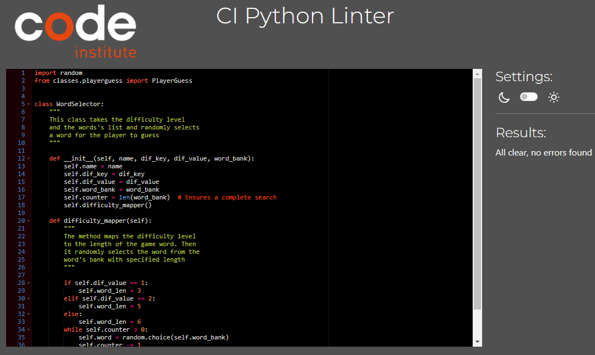
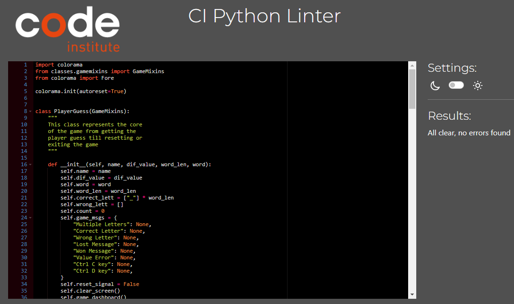
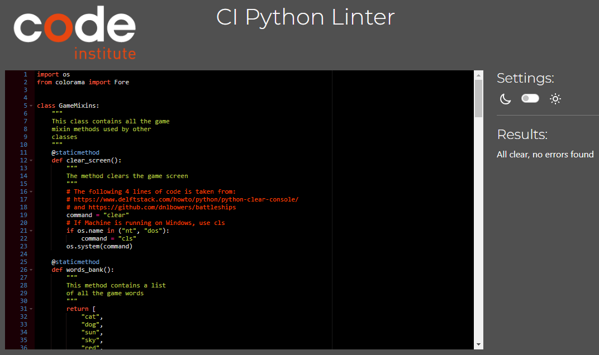

This file contains the captures of the test results of CI Python Linter for each class code.

1. Class InitiateGame

2. Class Player

1. Class DifficultySelection

1. Class WordSelector

1. Class PlayerGuess

1. Class GameMixins

Return to [Readme file](README.md)